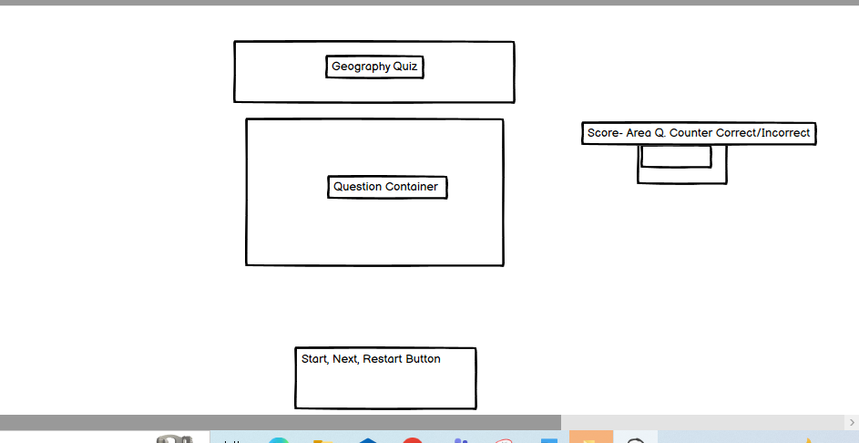
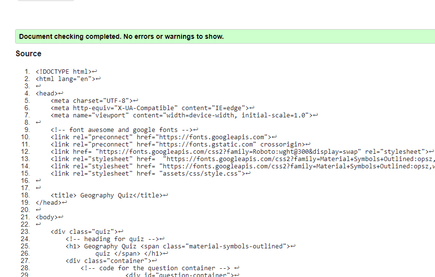
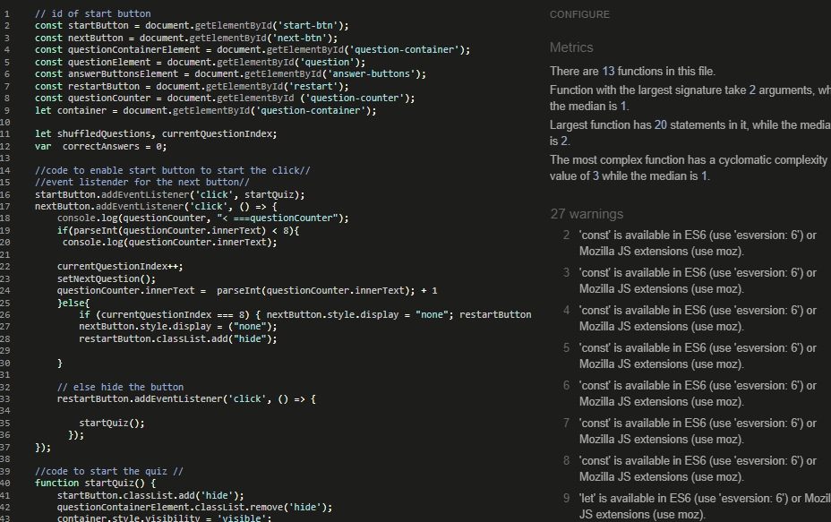
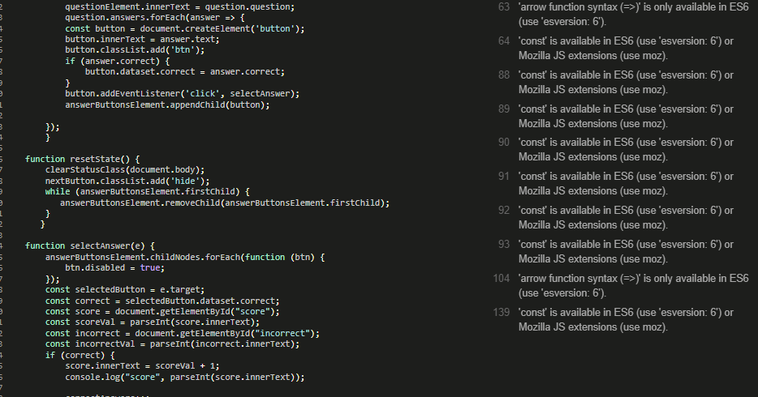
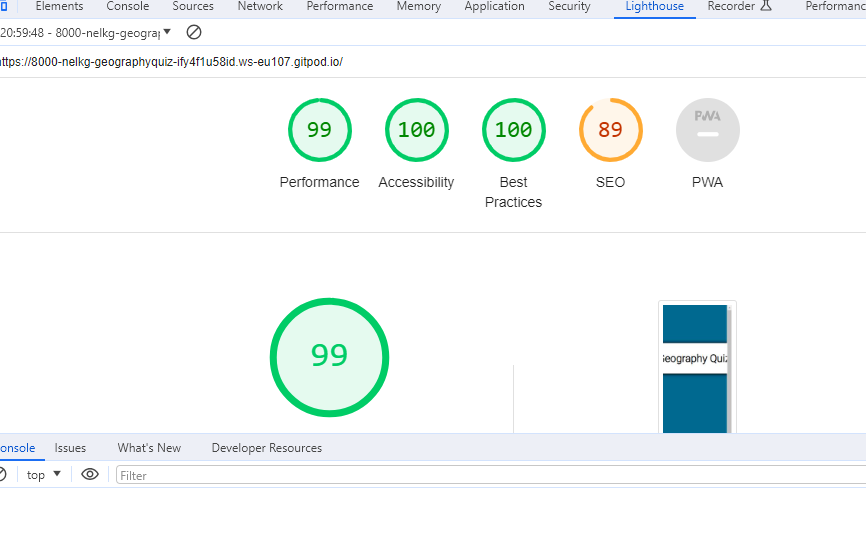
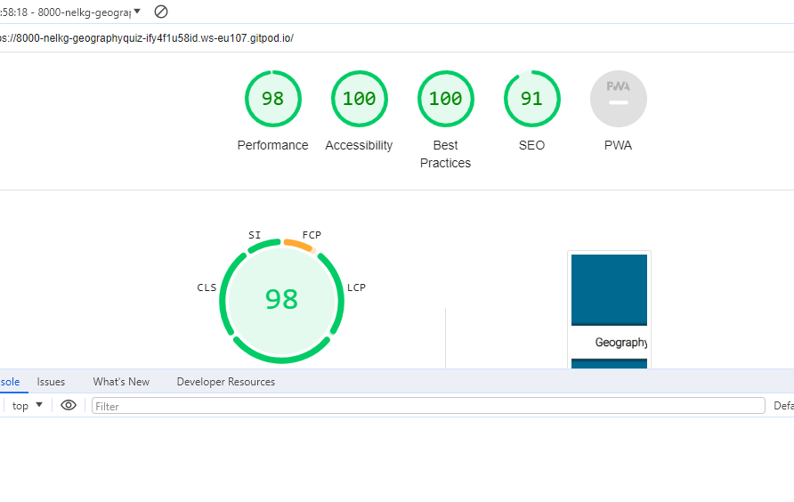

#### CONTENTS
- [User Experience (UX)](#user-experience-ux)
  - [User Stories](#user-stories)
  - [Client Goals](#client-goals)
  - [Return visitor goals](#return-visitor-goals)
- [Design](#design)
  - [Colour Scheme](#colour-scheme)
  - [Typography](#typography)
  - [Imagery](#imagery)
  - [Wireframes](#wireframes)
  - [W3C Code Validator](#w3c-code-validator)
- [Features](#features)
  - [General features on each page](#general-features-on-each-page)
  - [Future Implementations](#future-implementations)
  - [Accessibility](#accessibility)
- [Lighthouse](#lighthouse)
- [Technologies Used](#technologies-used)
  - [Languages Used](#languages-used)
  - [Frameworks, Libraries \& Programs Used](#frameworks-libraries--programs-used)
  - [Deployment](#deployment)
  - [Local Development](#local-development)
    - [How to Fork](#how-to-fork)
    - [How to Clone](#how-to-clone)
- [Testing](#testing)
  - [Credits](#credits)
  - [Code Used](#code-used)
  - [Content](#content)
  - [ Media](#media)
  - [ Acknowledgments](#acknowledgments)

## User Experience 
 url completed link here [View my Gituhub Profile] (https://nelkg.github.io/geography-quiz/)

### User Stories

User Experience (Ux)
geography-Quiz is a quiz designed to test the knowledge of the participant of the captial 
cities of the world. The questions will be shuffled each time the restart button is clicked. The questions will be in a different order. The correct and incorrect answer will be on display on each occassion. The correct answer will show in green and the incorrect answer will display in a red color on the screen. Once the correct or incorrect answer will be clicked, no other options will be enabled to be clicked on the page
1. the website is a quiz that tests geography from different parts of the world 
2. the user can take the quiz as many times as they would like 
3. the final score result will refelct if the user is improving after each occassion of taking the quiz
4. it is a quiz and fun game to test the knowledge
5. it is an easy and very accessible quiz to take part in

### Client goals 
1. view the site on a range of devices sizes
2. make it easy for the quiz to operate 
3. ensure the functionality is seamless

### design
view an example of a completed design section [here]

### Colour-Scheme

I choose the following colors throughout the quiz to ensure an elegeant and 
user friendly page. 
I choose the main background color of the page as a block colour which is appealing to the eye. 
I ensured the heading was very simple and easy to read. 
I like a plain heading to contrast with the block background colour of blue. I think the blue and white is appealing visually.

I was influenced by the kera-cudmore The QuizArms and the overall workings of the quiz.
I was further influecned by Web dev [youtube link here] <https://www.youtube.com/watch?v=riDzcEQbX6k>

The following colors were used as a mix of hex colors and rgba to make the color and contrast 
lighter and darker as needed 

1. #ffffff white background color of the container 

2. #006994 blue as the background colour 

3. #333 border bottom short hand property for setting border style and color

4. #ffffff8 light color and shade of white for the background color of the heading

5. #rgba, 255, 255, 255, 0.897 light shade of grey background in the button

6. #222 background of button - dark color for button font grey dark grey

7. #fff light color version of white 

8. #008035; green for correct answer 

9. #ff080073; red for an incorrect answer 

[here is the link to the website used for colors]
(https://www.w3schools.com/colors/colors_picker.asp)

### Typography
I choose fonts from [Google Fonts] which is a very popular website for importing fonts. 
I choose it for acessibility and it had the fonts weights and fonts very easily displayed. 
It was very east to import and copy the font which I did it did not require the font to be downloaded

https://fonts.google.com/specimen/Roboto?preview.text=Geography%20Quiz&preview.text_type=custom&query=roboto

I choose the fonts Roboto', sans-serif; which are clear easily visible and commonly used.  I used the weight 300 as it had a nice finish.
I wamted to create a clean simple font-style,the two i choose are very clear and neat
font choice font awesome and google fonts Light 300 font chosen. 

hexcode for light grey was chosen - #D3D3D3 #d3dede check which color. 

I used an icon of a question mark which I imported from [here is a link to the webpage] (https://fontawesome.com/)

### Wireframes 

 Wireframe

 

 

### W3C Code Validator - 

html code validator

 

 

details>

JJshint

 

 

 

JShint2

 

 

    

        
      
  ### Features 

### General Features on the page
There is a start button. Once the start button is clicked. The quiz will begin and the question container 
will appear. The question counter, correct and incorrect answers will appear and update once the next button is clicked. 

### Future Implementation 
For future implementation I would make the quiz more interactive 
I would ensure that there is a score feature added to the score area and that a Final score button is 
created to ensure the quiz participant can see their quiz and also see can them improve on their previous score 
I would ensure that the next button and resart button are working perfectly.

### Accessibility 
I have been mindful during coding to ensure that the website is as accessible friendly as possible. This has been have achieved by:

Using semantic HTML.
Using a hover state on all buttons on the site to make it clear to the user if they are hovering over a button.
Choosing a sans serif font for the site - these fonts are suitable for people with dyslexia.
Ensuring that there is a sufficient colour contrast throughout the site.

### Lighthouse

lighthouse desktop

 

 

I have added a pdf document which shows all the light house inspections for the desktop and mobile. 

lighthouse mobile

 

 

I have added a pdf document which shows all the light house inspections for the desktop and mobile. 

### Languages Used

As this is my second project HTML & CSS & Javacscript are the languages I used throughout this project.

### Frameworks, Libraries & Programs Used

1. Languages Used - HTML and CSS and Javascript  were used to build this quiz
2. Frameworks
3. Balsamiq was used to create wireframes
4. Git for version control
5. Github to save and store files for the website.
6. Google fonts to use the font code used on the website.
7. Font Awesome fro the icons used on the website11.
8. Google Dev tools to assist with the reponsiveness

### Deployment

1. Log in to Github.
2. Find the repository for this project, geography-Quiz.
3. Click on the Settings link.
4. Click on the Pages link in the left hand side navigation bar.
5. In the Source section, choose main from the drop down select branch menu. Select Root from the drop down select folder menu.
6. Click Save. Your live Github Pages site is now deployed at the URL show

I saved the code after it was added to Gitpod. I committed the cnages and then pushed the final code to 
Github. I saved the settings on my github page as a main root sourced and then I deployed the pages to github
### Local Development

The local development section gives instructions on how someone else could make a copy of your project to play with on their local machine. This section will get more complex in the later projects, and can be a great reference to yourself if you forget how to do this.

#### How to Fork

To fork the geography-quiz
log in to Github
Go to the repository for this project NelKG/geography-quiz
Click the fork button in thetop right corner

#### How to Clone

To clone geography-quiz
log in to Github
Go to the repository for geography-quiz
click on the code button, select whether you would like to lone with HTTPS, SSH or
GithuB CLI and copy the link shown

### Testing 

### Debugging 
its an ongoing process
I'm learning every day and becoming more knowledgdeable 
changing the position of the containers 
remove the next button once the restart button is clicked 
adding a reset values function to the quiz and a score display is future work which must be done 

### Credits 
I learned from the material provided in the Love Maths project and the material given in the code institute course. I used several sources and  you tube tutorials to learn how to get the question counter and the correct and incorrect buttons to work - 

### Code Used
 
The code used in this project was taken from several sources and influenced by several resources
1. Web dev dimplified - [youtube] <https://www.youtube.com/watch?v=PBcqGxrr9g8>

2. [James Quick Youtube ] <https://www.youtube.com/watch?v=jfOv18lCMmw&>

3. https://www.youtube.com/watch?v=PBcqGxrr9g8

4. https://www.youtube.com/watch?v=jfOv18lCMmw&list=PLDlWc9AfQBfZIkdVaOQXi1tizJeNJipEx&index=11>

 The part of the quiz function correct answer was taken from a youtube tutorial listed above no 1 and no 3.

 All the code used in this project was used from the sources above in the tutorials listed above.
 The initial idea and structure of the quiz was influenced by Web Dev and youtube tutorial no 3 listed above.
 I have used more code than I intended to from the sources above and tried to change it and edit it to perform in way I wanted the quiz to work. 

### Content 

The content on the page information for capital countries was taken from google confirming that correct questions and options for each question. The questions were derived by me. 

### Acknowledgements 
I would to thanks my mentor for his assistance.
 His sessions were very helpful and
practical. He gave me great feedback and guidance throughout each session.
I also referenced the github resource of <https://github.com/kera-cudmore/TheQuizArms/blob/main/README.md> 
I would like to thank all the staff at tutor support for the assistance at all times.
